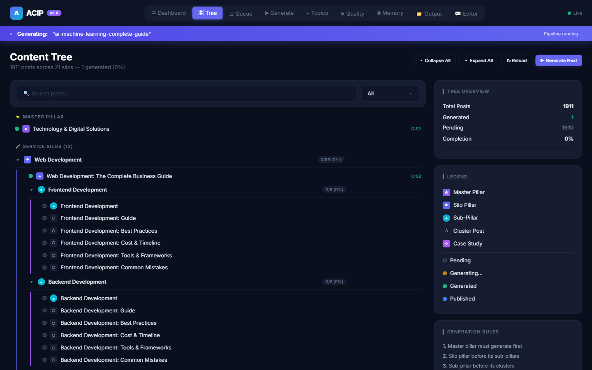
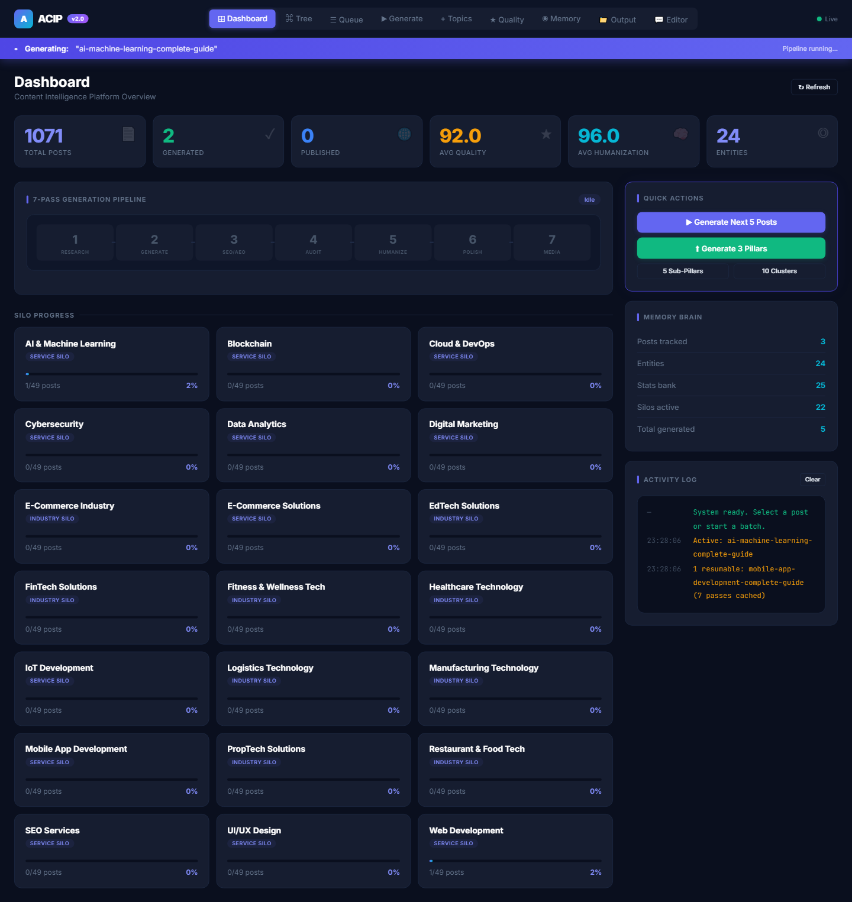
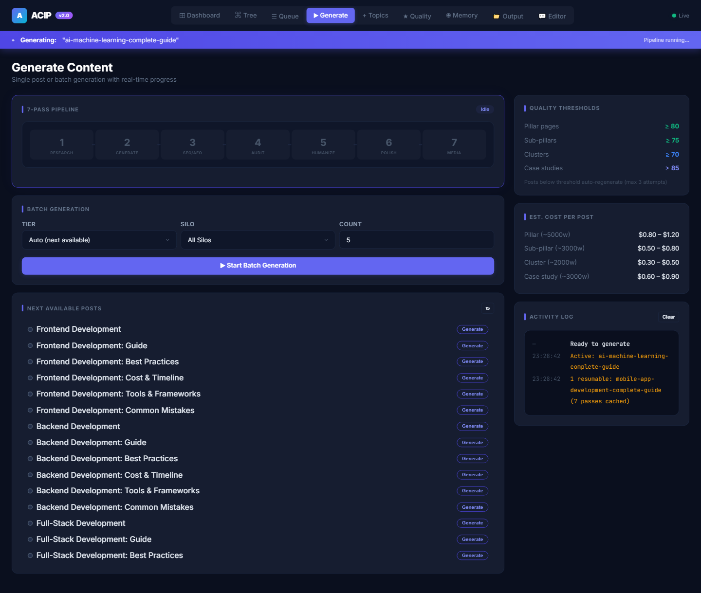
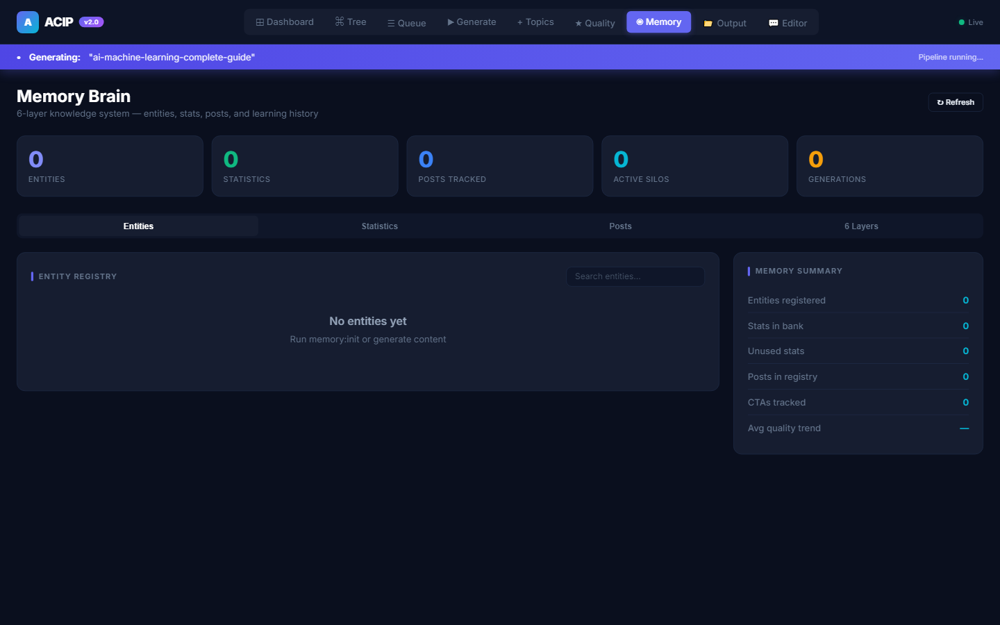
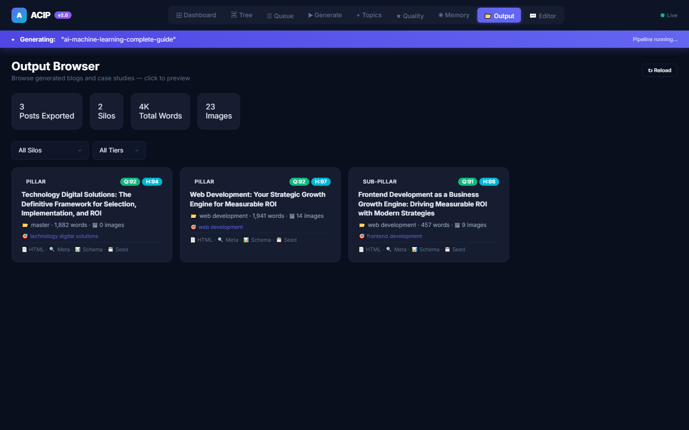
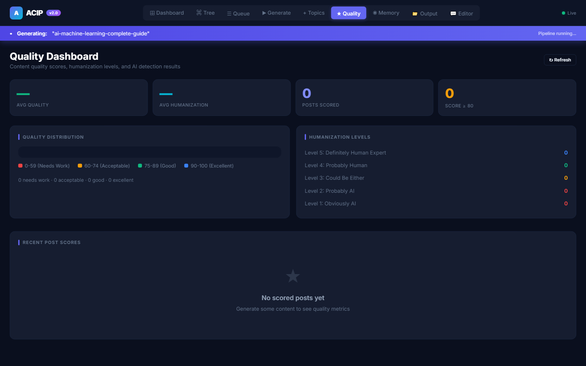

# ACIP - AI Content Intelligence Platform

> SEO-first content engine that plans topical authority and generates publish-ready articles at scale.

Built by **[Muhammad Tanveer](https://www.linkedin.com/in/muhammad-tanveer-advenno/)** - Full-Stack AI Automation Engineer.

[](#source-code-and-access) [](https://github.com/haddindeve)

## Contents

- [The problem](#the-problem)
- [The approach](#the-approach)
- [Architecture](#architecture)
- [Tech stack](#tech-stack)
- [Key capabilities](#key-capabilities)
- [Selected code](#selected-code)
- [Screenshots](#screenshots)
- [Results](#results)
- [FAQ](#faq)
- [Source code and access](#source-code-and-access)
- [About the engineer](#about-the-engineer)
- [Related projects](#related-projects)

## The problem

Building topical authority means producing large volumes of genuinely structured content. Done by hand it is slow and inconsistent; done naively with an LLM it produces undifferentiated text that does not rank.

## The approach

A pipeline rather than a prompt. Topic planning establishes the cluster, distinct article templates enforce different structures - authority piece, deep dive, specialist, comparison, case study - and a generation stage fills them. Because each template has its own shape, the output does not collapse into one repeated format.

## Architecture

| Component | Responsibility |
| --- | --- |
| **Topic planning** | Cluster and authority mapping |
| **Template engine** | Five structurally distinct article formats |
| **Generation pipeline** | Staged content production |
| **Publishing output** | HTML and PHP render targets |
| **CLI** | Scriptable pipeline control |

## Tech stack

| Layer | Technology |
| --- | --- |
| Language | JavaScript, Node.js |
| Generation | LLM content pipeline |
| Templates | HTML and PHP article formats |
| Interface | Command-line pipeline runner |

## Key capabilities

- Topical authority planning
- Five distinct article templates
- Staged generation pipeline
- SEO-structured output
- CLI-driven batch production

## Selected code

From `acip/src/pipeline/Pipeline.js` in the private repository:

```javascript
import { config } from '../../config/default.js';
import { SYSTEM_PROMPTS, buildHumanizationPrompt } from './prompts.js';
import { GenerationStateManager } from './GenerationStateManager.js';
import { InternalLinkEngine } from '../generators/InternalLinkEngine.js';
import { BlogExporter } from '../publishers/BlogExporter.js';
import { ImageOptimizer } from '../api-orchestra/ImageOptimizer.js';
import { AuthorManager } from '../generators/AuthorManager.js';
import { AIDetectionResistance } from '../enterprise/AIDetectionResistance.js';
import { CompetitiveIntelligence } from '../enterprise/CompetitiveIntelligence.js';
import { SentimentEngine } from '../enterprise/SentimentEngine.js';
import { BuyerJourneyEngine } from '../enterprise/BuyerJourneyEngine.js';
import { VoiceFingerprint } from '../enterprise/VoiceFingerprint.js';
import { SelfImprovementLoop } from '../enterprise/SelfImprovementLoop.js';
import { EditorialWorkflow } from '../enterprise/EditorialWorkflow.js';
import { OriginalityChecker } from '../enterprise/OriginalityChecker.js';

/**
 * THE 7-PASS GENERATION PIPELINE (ENHANCED + RESUMABLE)
 *
 * Pass 1: Research & Strategy       — THINK about what to write
```

## Screenshots













## Results

- Content volume achievable without one repeated article shape
- Structure decided by template rather than left to the model

## FAQ

### How is this different from prompting ChatGPT for blog posts?

The pipeline plans a topic cluster first and generates into five structurally different templates, so output varies in shape and serves a deliberate authority map.

### What does 'SEO-first' mean here?

Structure, internal linking and topical coverage are planned before generation, rather than edited in afterwards.

### Can it publish directly?

It emits publish-ready HTML and PHP for the target site.

### Is the source available?

Private; access on request.

## Source code and access

This repository is the public case study for **ACIP - AI Content Intelligence Platform**. The full implementation - application code, database schema, tests and deployment configuration - lives in a **private repository** on this account, alongside the rest of the work shown here.

Source access can be arranged for hiring conversations, technical review or client due diligence. The quickest route is a short message on [LinkedIn](https://www.linkedin.com/in/muhammad-tanveer-advenno/) or an email to [mtanveertahir6666@gmail.com](mailto:mtanveertahir6666@gmail.com).

## About the engineer

**Muhammad Tanveer - Full-Stack AI Automation Engineer**

Full-stack AI automation engineer. I build agentic systems, browser and workflow automation, RAG pipelines and the production web platforms they run on - from Rust and Python services to Next.js dashboards and PHP/MySQL business systems.

- GitHub: [haddindeve](https://github.com/haddindeve)
- LinkedIn: [Muhammad Tanveer](https://www.linkedin.com/in/muhammad-tanveer-advenno/)
- Email: [mtanveertahir6666@gmail.com](mailto:mtanveertahir6666@gmail.com)
- Location: Pakistan

## Related projects

- [SJ-AIOS - AI Operating System for Retail Operations](https://github.com/haddindeve/sj-aios-ai-operating-system)
- [ARMenu - Augmented Reality Restaurant Menu SaaS](https://github.com/haddindeve/armenu-augmented-reality-menu-saas)
- [Hafiz Fabrics - Retail POS and ERP](https://github.com/haddindeve/hafiz-fabrics-pos-erp)
- [Doctern - AI Document OCR and Table Extraction](https://github.com/haddindeve/doctern-document-ocr-ai)
- [LinkedIn Lead Finder and Analyser](https://github.com/haddindeve/linkedin-lead-finder-and-analyser)
- [CRAlign - AI Musculoskeletal Wellness Assessment](https://github.com/haddindeve/cralign-msk-wellness-ai)

---

<sub>ACIP - AI Content Intelligence Platform - case study by Muhammad Tanveer - Full-Stack AI Automation Engineer. Keywords: AI content generation, SEO content automation, topical authority, programmatic SEO, content pipeline, automated blog publishing.</sub>